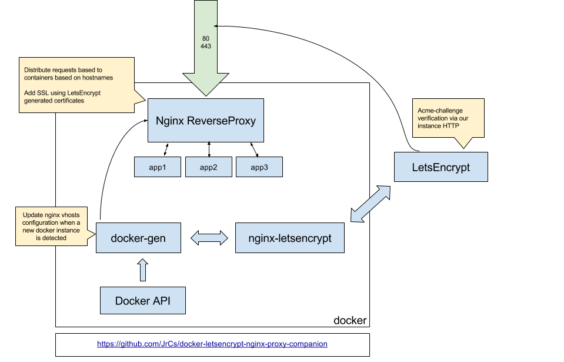

# How To: Multiple WordPress sites on one DO droplet using Docker Compose

This week I was trying to figure out how to setup multiple WordPress sites on a single DigitalOcean droplet so I could set up some blogs for my wife without paying for multiple instances (she is just starting out so the traffic is nearly zero). This turned into much more of an ordeal than I was expecting so I wanted to document what I found and provide some more details than I was able to find by searching around. 

I gave myself three additional constraints going in:

- I wanted to use Docker Compose to setup the droplet. This is partially because I just haven't played with Docker all that much professionally and partially because it makes it easier to drop the same configuration on a VPS hosted by someone other than DigitalOcean (as opposed to having to redo all the command line config manually). 
- I wanted all the WordPress instances to share a single instance of MySQL (I ended up using MariaDB instead because boo Oracle). MySQL and MariaDB are pretty resource heavy and there didn't seem to be a good reason to run two database containers. 
- All the websites needed to use HTTPs because this is just good practice nowadays. I also wanted HTTP to redirect to HTTPs and both example.com and www.example.com to work as addresses.

To pull this off, I made use of two projects I found on GitHub, [nginx-proxy](https://github.com/jwilder/nginx-proxy) and [docker-letsencrypt-nginx-proxy-companion](https://github.com/JrCs/docker-letsencrypt-nginx-proxy-companion). I attempted to use the nginx Docker image directly but for some reason could never get WordPress to correctly handle requests. The nginx-proxy image automatically generates nginx reverse proxy configs for containers as they are created. The companion image handles the automatic creation, renewal, and use of Let's Encrypt certificates for proxied containers. JrCs has created a good diagram that explains how they work together: 


### docker-compose.yml

You can look at and download the finished scripts in the [multiple-wordpress-containers](https://github.com/arnath/multiple-wordpress-containers) repo. Below I'll go through each part of the docker-compose.yml file to provide some detailed explanations of what's going on. 

#### Database

```yml
services:
    db:
        image: mariadb:10
        container_name: db
        restart: unless-stopped
        env_file: .env
        volumes:
            - database:/var/lib/mysql
            - ./mariadb:/docker-entrypoint-initdb.d
        networks:
            - proxy-network
```
This block sets up the database container based off the [mariadb:10](https://hub.docker.com/_/mariadb) image. 


```yml
env_file: .env
```
The repo contains a sample .env file that defines some environment variables for use in the docker-compose.yml file. In this service, they are used to create the WordPress databases and assign permissions to the user account.


```yml
volumes:
    - database:/var/lib/mysql
    - ./mariadb:/docker-entrypoint-initdb.d
```
When you define a volume with a name instead of a path like `database:...`, this creates a named, Docker managed volume. We use this to map the `/var/lib/mysql` folder from the container to the named volume because this is where the databases are stored on disk.

The second line copies the `mariadb/init.sh` script to the `/docker-entrypoint-initdb.d` directory in the container. Scripts in this container are run by the mariadb image on startup. The image provides a way to create a database and provide permissions using an environment variable but this only works for a single database. I wanted to use a database per site so I had to create a shell script to do this for me.

```bash
#!/bin/bash

mysql -uroot -p$MYSQL_ROOT_PASSWORD -e "CREATE DATABASE IF NOT EXISTS $SITE1_DB_NAME; GRANT ALL ON $SITE1_DB_NAME.* TO '$MYSQL_USER'@'%' IDENTIFIED BY '$MYSQL_PASSWORD';"
mysql -uroot -p$MYSQL_ROOT_PASSWORD -e "CREATE DATABASE IF NOT EXISTS $SITE2_DB_NAME; GRANT ALL ON $SITE2_DB_NAME.* TO '$MYSQL_USER'@'%' IDENTIFIED BY '$MYSQL_PASSWORD';"
```
This file uses the environment variables defined in the .env file to create databases for each site and assign permissions to the WordPress user account.


```yml
networks:
- proxy-network
```
I put all the containers on a shared bridge network to allow them to communicate with each other. 
